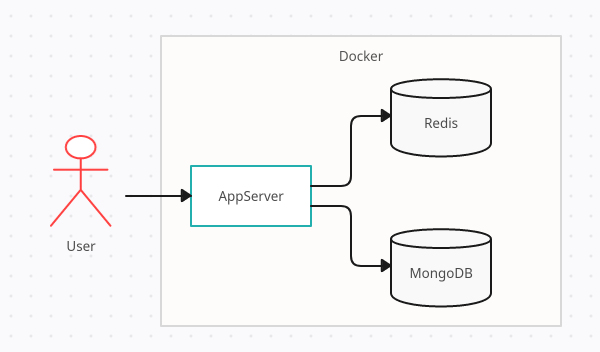

# About project

## Simple Spring Boot project based on Mongo, Redis and Docker Compose

### Task Description

Design and implement a simple REST API for asynchronous Tasks Processing.

Task description:
1. Design API which allows to create a task, list all tasks, read the status and the results of the task
2. When the task is created the customer receives the unique id of the task
3. The customer can check the status and the results of the task using the received id

Functional requirements:
* Task accepts two strings as the parameters: the pattern and the input
* Task should find the first best match – position of the pattern in the input with the least number of different characters. For example:
* Input: ABCD, pattern: BCD -> position:1, typos:0 (‘BCD’ matches exactly substring on position 1)
* Input: ABCD, pattern: BWD -> position:1, typos:1 (‘BCD’ matches, ‘W’ is a typo here)
* Input: ABCDEFG, pattern: CFG -> position:4, typos:1 (‘EFG’ is better match than ‘CDE’)
* Input: ABCABC, pattern: ABC -> position:0, typos:0 (matches exactly twice, selects first)
* Input: ABCDEFG, pattern: TDD -> position:1, typos:2 (match first - BCD, not CDE)
* The result of the task is the position of the pattern in the input and the number of the typos
* While one task is executing the next tasks can also be started and processed, API is not blocked
* The status of the task should contain the information about the progress (in %)
   
Technical requirements:
* Provide a docker-compose file that prepares the required stack. Choose the tools and libraries on your own
* Use Spring Boot with Java 14+ (Spring initializr might be helpful https://start.spring.io/ )
* You may use Thread.sleep(1000) or similar approach so the tasks processing takes more time
* Please use GitHub, Bitbucket or similar tool
* Please document briefly how to start the application and how to use the API
* Cache API responses

## Solution
### App Structure



### How to build and run application

1. Clone sources of [project](https://github.com/NadiaLogvinova/cdq-recruitment-task.git) from GitHub:
```bash
git clone https://github.com/NadiaLogvinova/cdq-recruitment-task.git
```

2. You also need Docker. See https://docs.docker.com/installation/#installation for details on setting Docker up for your machine. Before proceeding further, verify you can run docker commands from the shell.

3.  Build and run the application, Mongo and Redis containers using the command (run from the Intellij IDEA terminal or from the root of project command line)
```bash
docker-compose up
```
4. Go to <http://localhost:8080>. You will see swagger UI with application API. 

5. To stop the application, use Ctrl + C in the terminal or this command from the command line:
```bash
docker-compose down
```